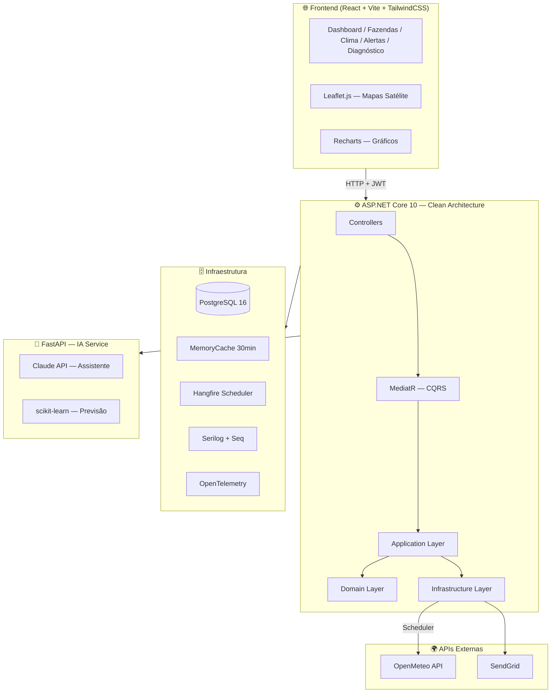
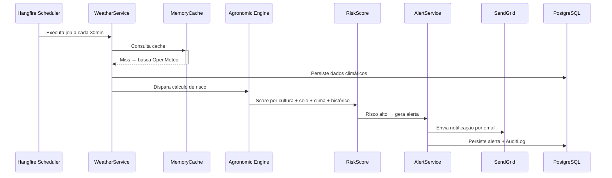

<p align="center">
  
</p>

<p align="center">
  <a href="https://github.com/alessandro-a11y/agromind-ai/actions/workflows/ci.yml">
    
  </a>
  
  
  
  
  
  
</p>

<p align="center">
  Plataforma SaaS de monitoramento agrícola com diagnóstico agronômico inteligente, análise climática em tempo real e motor de regras próprio — construída com Clean Architecture, CQRS e Machine Learning.
</p>

---

## 🖥️ Interface

> Dashboard com mapa de satélite, indicadores de saúde das lavouras, alertas em tempo real e gráficos de tendência.

| Dashboard | Fazendas |
|-----------|----------|
| Mapa interativo com talhões coloridos por saúde, cards de condições climáticas, alertas ativos e atividades recentes | Tabela de propriedades com filtros, mapa de marcadores, gráfico de distribuição por cultura e KPIs |

| Clima | Diagnósticos |
|-------|-------------|
| Previsão 7 dias, mapa de precipitação, histórico climático com gráficos compostos e recomendações agronômicas | Análises detalhadas por talhão, mapa de severidade, tendência de indicadores e recomendações da IA |

---

## 🏛️ Arquitetura



---

## 🔄 Fluxo Principal



---

## ✅ Status das Sprints

| Sprint | Tema | Status |
|--------|------|--------|
| Sprint 1 | Fundação (Auth, Clean Arch, Docker, Migrations) | ✅ Concluído |
| Sprint 2 | Núcleo Agrícola (CRUD + OpenMeteo + Dashboard) | ✅ Concluído |
| Sprint 3 | Scheduler + Alertas (Hangfire + SendGrid) | ✅ Concluído |
| Sprint 4 | Motor Agronômico (Engine + PDF + OpenTelemetry) | ✅ Concluído |
| Sprint 5 | Frontend + Deploy (React + Render + CI/CD) | ✅ Concluído |
| Sprint 6 | IA + ML (FastAPI + Claude + scikit-learn) | 🔄 Em andamento |

---

## ⚙️ Stack Tecnológica

### Backend
| Tecnologia | Versão | Uso |
|-----------|--------|-----|
| ASP.NET Core | 10.0 | API REST principal |
| Entity Framework Core | 10.0 | ORM + Migrations versionadas |
| MediatR | — | CQRS (Commands + Queries) |
| FluentValidation | — | Validação de DTOs |
| Hangfire | — | Scheduler de jobs |
| Serilog | — | Structured logging (Seq / PostgreSQL) |
| OpenTelemetry | — | Distributed tracing |
| QuestPDF | — | Geração de relatórios PDF |
| BCrypt | cost 12 | Hash de senhas |

### Frontend
| Tecnologia | Versão | Uso |
|-----------|--------|-----|
| React | 19 | SPA |
| Vite | 8 | Bundler |
| TailwindCSS | 4 | Estilização |
| Recharts | 3 | Gráficos (clima, risco, tendência) |
| Leaflet.js | 1.9 | Mapas interativos com satélite |
| React Router | 7 | Roteamento + rotas privadas |
| Axios | — | HTTP client + interceptor JWT |

### IA / ML
| Tecnologia | Uso |
|-----------|-----|
| FastAPI | API Python para serviço de IA |
| Claude API (Anthropic) | Assistente agrícola conversacional |
| scikit-learn | Previsão de produtividade |

### Infraestrutura
| Tecnologia | Uso |
|-----------|-----|
| PostgreSQL 16 | Banco principal |
| Docker Compose | Ambiente local (PG + pgAdmin + Seq) |
| Render | Deploy em nuvem (Frontend + API + FastAPI + DB) |
| GitHub Actions | CI/CD com bloqueio de merge em falha |

---

## 🔐 Segurança

- **JWT** com access token de 15 minutos + **Refresh Token Rotation** (7 dias)
- **BCrypt** com cost 12 para hash de senhas
- **Rate Limiter** nativo do .NET
- **AuditLog** via EF Core Interceptor (rastreia todas as operações)
- **CORS** explícito por origem
- **HTTPS** enforcement em produção
- Comunicação entre API e FastAPI via **API Key interna**

---

## 🧪 Testes

```bash
# Todos os testes
dotnet test AgroMind.slnx

# Somente unitários
dotnet test tests/AgroMind.UnitTests

# Somente integração (requer Docker)
dotnet test tests/AgroMind.IntegrationTests
```

| Projeto | Framework | O que testa |
|---------|-----------|------------|
| `AgroMind.UnitTests` | xUnit + FluentAssertions + NSubstitute | `CalculateRiskService`, `DiagnosisEngine`, `WeatherService`, Auth handlers |
| `AgroMind.IntegrationTests` | xUnit + Testcontainers (PostgreSQL) | Endpoints HTTP completos com banco real |

---

## 🏃 Rodando Localmente

### Pré-requisitos
- [.NET 10 SDK](https://dotnet.microsoft.com/download)
- [Node.js 22+](https://nodejs.org)
- [Docker Desktop](https://www.docker.com/products/docker-desktop)

### Backend

```bash
# Clone o repositório
git clone https://github.com/alessandro-a11y/agromind-ai.git
cd agromind-ai

# Suba PostgreSQL + pgAdmin + Seq
docker compose up -d

# Restaure e rode a API
dotnet restore
dotnet run --project src/AgroMind.API
```

A API estará disponível em `http://localhost:5044`

### Frontend

```bash
cd agromind-web
npm install
npm run dev
```

O frontend estará disponível em `http://localhost:5173`

### FastAPI (IA Service)

```bash
cd ia-service
pip install -r requirements.txt
uvicorn main:app --reload --port 8000
```

---

## 🚀 Deploy

O projeto está configurado para deploy automático na [Render](https://render.com) via `render.yaml`:

| Serviço | Tipo | URL |
|---------|------|-----|
| Frontend | Static Site | `agromind-frontend.onrender.com` |
| API .NET | Web Service | `agromind-api.onrender.com` |
| FastAPI | Web Service | `agromind-fastapi.onrender.com` |
| PostgreSQL | Managed DB | interno |

### CI/CD

```
Push para main
    │
    ▼
GitHub Actions CI
    ├── Backend Build + Unit Tests
    ├── Backend Integration Tests (Testcontainers)
    └── Frontend Lint + Build
    │
    ▼ (somente se tudo passou)
GitHub Actions CD
    └── Trigger Render Deploy Hook → Health Check
```

> ⚠️ **PRs só são mergeáveis se todos os jobs do CI passarem** (proteção de branch configurada no GitHub).

---

## 🔭 Health Check

```http
GET /api/health
```

Serviços monitorados:
- ✅ PostgreSQL (conexão + latência)
- ✅ OpenMeteo API
- ✅ FastAPI service

---

## 📁 Estrutura do Projeto

```
agromind-ai/
├── .github/
│   └── workflows/
│       ├── ci.yml          # Build + testes (bloqueia merge com falha)
│       └── cd.yml          # Deploy automático na Render
├── src/
│   ├── AgroMind.API/       # Controllers, Middlewares, Program.cs
│   ├── AgroMind.Application/  # CQRS Commands/Queries, DTOs, Validators
│   ├── AgroMind.Domain/    # Entities, Enums, Value Objects
│   └── AgroMind.Infrastructure/  # EF Core, Repositories, Services
├── tests/
│   ├── AgroMind.UnitTests/        # Testes unitários (xUnit + NSubstitute)
│   └── AgroMind.IntegrationTests/ # Testes integração (Testcontainers)
├── agromind-web/           # Frontend React + Vite
│   └── src/
│       ├── pages/          # Dashboard, Fazendas, Clima, Alertas, Diagnóstico
│       ├── components/     # Layout, Map, Charts, UI
│       ├── services/       # API client (axios + interceptors)
│       └── store/          # AuthContext
├── ia-service/             # FastAPI + Claude + scikit-learn
├── render.yaml             # Configuração de deploy (IaC)
├── docker-compose.yml      # Ambiente local (PG + pgAdmin + Seq)
└── AgroMind.slnx           # Solution .NET
```

---

## 📄 License

MIT License — see [LICENSE](LICENSE) for details.
